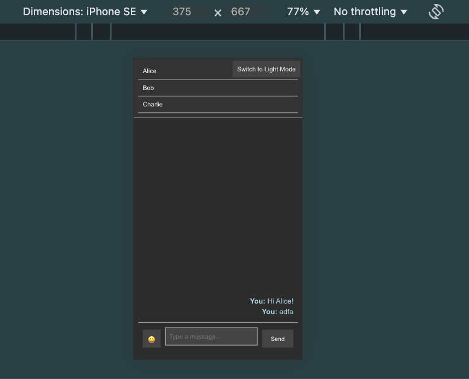

```markdown
# Chat Application

A simple, responsive chat application built with React, featuring:
- Light/Dark mode toggle.
- Emoji support with an emoji picker.
- Responsive design for mobile and desktop.

## Features

1. **Responsive Design**: Optimized for various screen sizes, including desktop and mobile.
2. **Dark/Light Mode**: Toggle between dark and light themes.
3. **Emoji Support**: Add emojis to your messages via an integrated emoji picker.

## Technologies Used

- **Frontend**: React.js
- **Styling**: CSS
- **Emoji Picker**: [emoji-picker-react](https://github.com/ealush/emoji-picker-react)

## Installation and Setup

1. Clone the repository:
   ```bash
   git clone https://github.com/raodilip/Chat-Application.git
   cd Chat-application
   ```

2. Install dependencies:
   ```bash
   npm install
   ```

3. Start the development server:
   ```bash
   npm start
   ```

4. Open your browser and navigate to `http://localhost:3000`.


## How to Use

1. **Send Messages**: Type a message in the input field and hit the "Send" button.
2. **Switch Friends**: Click on a friend's name from the friend list to load the respective chat.
3. **Toggle Themes**: Use the dark/light mode toggle button to switch themes.
4. **Add Emojis**: Click the emoji button to open the emoji picker and select emojis for your messages.


## Responsive Design

- Desktop Layout: Displays friend list and chat window side by side.
- Mobile Layout: Displays either the friend list or chat window at a time, optimized for smaller screens.

## Dependencies

- `react`: For building the user interface.
- `emoji-picker-react`: For adding emoji support.

## Unit Tests

The project includes unit tests to ensure the core functionalities work as expected. The tests are written using **Jest** and **React Testing Library**.

### Tested Components and Features

1. **ChatWindow Component**
   - Verifies that messages are rendered correctly in the chat window.
   - Ensures new messages are added dynamically when sent.

2. **FriendList Component**
   - Confirms that the friend list renders correctly with the provided data.
   - Simulates clicking on a friend's name to load their chat.

3. **MessageInput Component**
   - Checks that the input field updates correctly as the user types.
   - Ensures the "Send" button calls the appropriate handler to send messages.

### Running the Tests

To run the unit tests, use the following command:

```bash
npm test
```

## Screenshots

### Light Mode


### Dark Mode

### Mobile Layout

